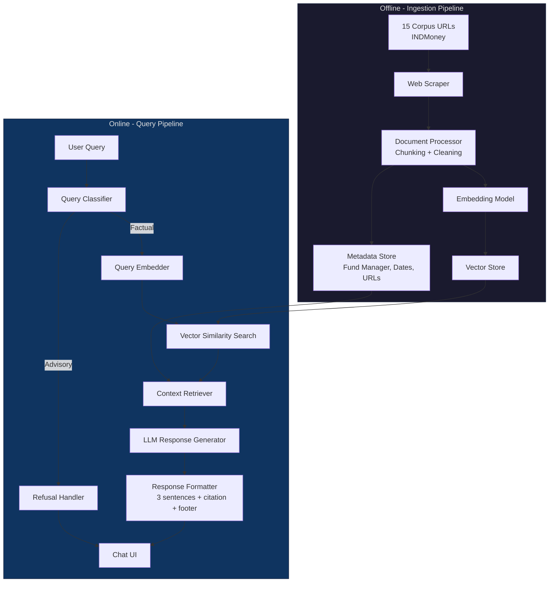
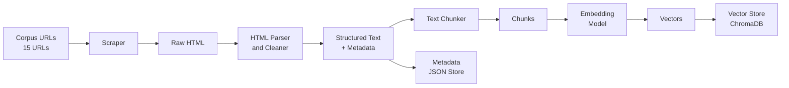
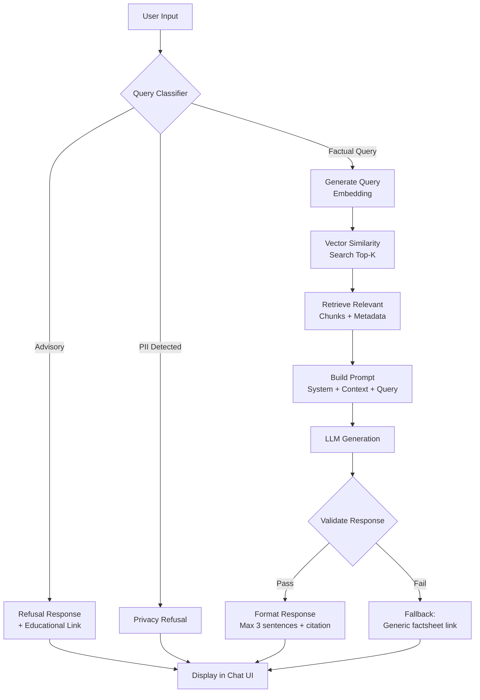
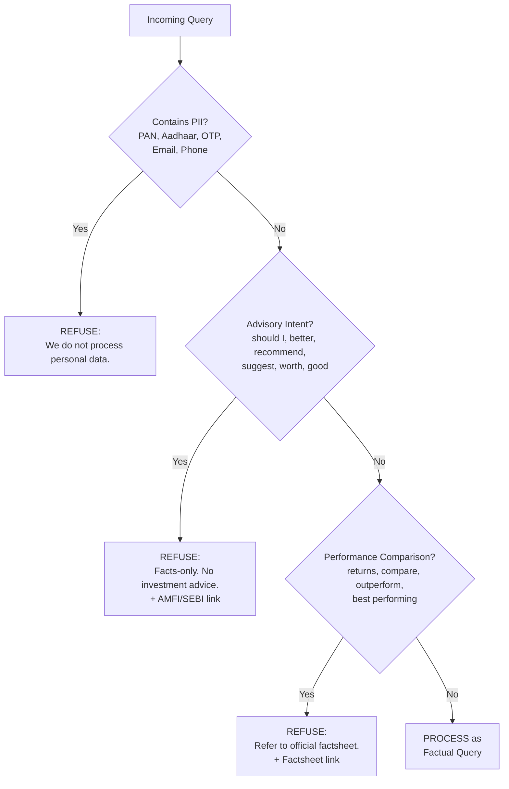
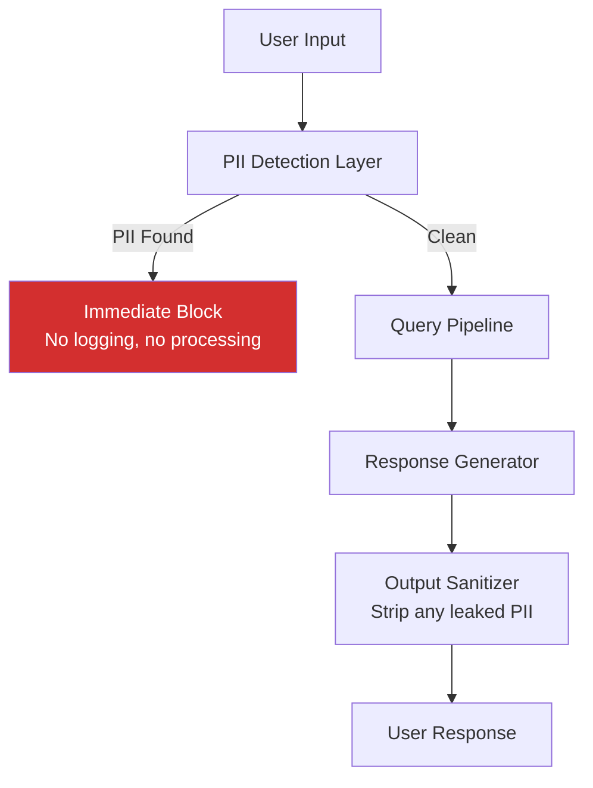
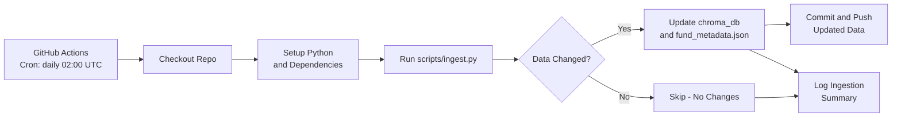

# Mutual Fund FAQ Assistant — Architecture Document

## 1. High-Level Architecture

The system follows a **Retrieval-Augmented Generation (RAG)** pattern with a clear separation between the **ingestion pipeline** (offline, scheduled daily via GitHub Actions) and the **query pipeline** (online/real-time).



---

## 2. System Components

### 2.1 Ingestion Pipeline (Scheduled Daily)

Runs automatically every day via **GitHub Actions**. Can also be triggered manually on demand.



| Stage | Description |
|---|---|
| **Web Scraper** | Fetches HTML from 15 INDMoney corpus URLs. Handles rate limiting and retries. |
| **HTML Parser & Cleaner** | Strips navigation, ads, scripts. Extracts fund-specific content: NAV, expense ratio, fund manager, exit load, SIP details, riskometer, benchmark, etc. |
| **Metadata Extractor** | Auto-extracts structured fields — fund manager name(s), last updated date, source URL, fund category — stored alongside each document. |
| **Text Chunker** | Splits cleaned text into overlapping chunks (≈500 tokens, 50-token overlap) to preserve context at chunk boundaries. |
| **Embedding Model** | Converts text chunks into dense vector embeddings for semantic search. |
| **Vector Store** | Persists embeddings with metadata for fast similarity retrieval. |

### 2.2 Query Pipeline (Online)

Handles user queries in real-time.



| Stage | Description |
|---|---|
| **Query Classifier** | Determines if the query is factual, advisory, or contains PII. Uses keyword matching + LLM classification. |
| **Query Embedder** | Embeds the user query using the same model as ingestion for consistent vector space. |
| **Vector Search** | Retrieves top-K (K=3–5) most similar chunks from the vector store. |
| **Context Builder** | Assembles retrieved chunks and their metadata into a structured prompt context. |
| **LLM Generator** | Generates a concise, facts-only response grounded in the retrieved context. |
| **Response Validator** | Ensures: ≤3 sentences, exactly 1 citation, no advisory language, includes footer. |
| **Refusal Handler** | Returns a polite refusal with an educational link (AMFI/SEBI) for non-factual queries. |

---

## 3. Query Classification Logic



### Classification Categories

| Category | Example Queries | Action |
|---|---|---|
| **Factual** | "What is the expense ratio of ICICI Small Cap Fund?" | Process via RAG pipeline |
| **Advisory** | "Should I invest in ELSS fund?" | Polite refusal + AMFI link |
| **Comparison** | "Which fund gave better returns?" | Refusal + factsheet link |
| **PII** | "My PAN is ABCDE1234F" | Privacy refusal, no processing |
| **Out-of-scope** | "What's the weather today?" | Polite redirect to fund queries |

---

## 4. Data Model

### 4.1 Document Chunk Schema

```json
{
  "chunk_id": "uuid-v4",
  "fund_name": "ICICI Prudential Small Cap Fund – Direct Plan Growth",
  "fund_category": "Equity Funds",
  "source_url": "https://www.indmoney.com/mutual-funds/...",
  "chunk_text": "The expense ratio of this fund is 0.64%...",
  "chunk_index": 3,
  "total_chunks": 12,
  "metadata": {
    "fund_manager": "Anish Tawakley, Shivam Shrivastav",
    "last_scraped": "2026-06-04",
    "category": "Small Cap Fund",
    "plan": "Direct Plan Growth"
  },
  "embedding": [0.023, -0.041, 0.118, ...]
}
```

### 4.2 Fund Metadata Schema

```json
{
  "fund_id": "icici-pru-smallcap-direct-growth",
  "fund_name": "ICICI Prudential Small Cap Fund – Direct Plan Growth",
  "category": "Small Cap Fund",
  "fund_group": "Equity Funds",
  "source_url": "https://www.indmoney.com/mutual-funds/icici-prudential-smallcap-fund-direct-plan-growth-3588",
  "fund_managers": ["Auto-extracted from source"],
  "last_updated": "2026-06-04",
  "fields_extracted": [
    "expense_ratio",
    "exit_load",
    "min_sip",
    "min_lumpsum",
    "benchmark",
    "riskometer",
    "lock_in_period",
    "fund_manager"
  ]
}
```

---

## 5. Response Format Specification

Every response from the assistant follows this strict template:

```
┌─────────────────────────────────────────────────┐
│  [Answer — Max 3 sentences, facts only]         │
│                                                 │
│  Source: [Clickable citation link]               │
│  Last updated from sources: YYYY-MM-DD          │
└─────────────────────────────────────────────────┘
```

### Example — Factual Response

> The expense ratio of ICICI Prudential Small Cap Fund (Direct Plan Growth) is 0.64%. This is the total expense ratio (TER) charged to investors in the direct plan.
>
> **Source:** [INDMoney – ICICI Prudential Small Cap Fund](https://www.indmoney.com/mutual-funds/icici-prudential-smallcap-fund-direct-plan-growth-3588)
> *Last updated from sources: 2026-06-04*

### Example — Refusal Response

> I can only provide factual information from official sources. For personalized investment advice, please consult a SEBI-registered financial advisor.
>
> **Learn more:** [AMFI – Investor Education](https://www.amfiindia.com/investor-corner/knowledge-center.html)
> *Last updated from sources: 2026-06-04*

---

## 6. Tech Stack

| Layer | Technology | Rationale |
|---|---|---|
| **Frontend** | HTML + CSS + JavaScript | Lightweight, no framework overhead, per project requirements |
| **Styling** | Vanilla CSS (warm cafe theme) | Premium look, modern feel |
| **Backend** | Python (FastAPI) | Async support, fast, easy to build REST APIs |
| **Scraping** | BeautifulSoup + curl-cffi | Impersonates Chrome to bypass Cloudflare 403 blocks |
| **Chunking** | LangChain `RecursiveCharacterTextSplitter` | Smart chunking with overlap, widely adopted |
| **Embeddings** | BAAI/bge-large-en-v1.5 (Local Sentence Transformers) | High quality local semantic embeddings |
| **Vector Store** | ChromaDB (local, persistent) | Zero-config, file-based, ideal for 15-URL corpus |
| **LLM** | Groq (llama-3.3-70b-versatile) | Fast, cost-effective, state-of-the-art completion model |
| **Response Validation** | Custom Python validator | Enforces 3-sentence limit, citation check, footer |
| **Scheduler** | GitHub Actions (cron) | Daily automated ingestion, no external infra needed |

---

## 7. Prompt Engineering

### System Prompt (Core)

```text
You are a facts-only mutual fund FAQ assistant for ICICI Prudential Mutual Fund schemes.

RULES:
1. Answer ONLY factual, verifiable questions about mutual fund schemes.
2. Use ONLY the provided context to answer. Do NOT use your training data.
3. Keep responses to a MAXIMUM of 3 sentences.
4. Include EXACTLY ONE source citation link in every response.
5. End every response with: "Last updated from sources: <date>"
6. NEVER provide investment advice, opinions, or recommendations.
7. NEVER compare fund performance or calculate returns.
8. If the query is advisory, refuse politely and provide an AMFI/SEBI link.
9. If PII is detected (PAN, Aadhaar, phone, email, OTP), refuse immediately.
10. If you cannot find the answer in the context, say so and link to the official factsheet.

DISCLAIMER: "Facts-only. No investment advice."
```

### Prompt Template

```text
CONTEXT:
{retrieved_chunks}

METADATA:
Fund: {fund_name}
Category: {fund_category}
Source: {source_url}
Last Scraped: {last_scraped_date}

USER QUERY:
{user_query}

Respond following the system rules strictly.
```

---

## 8. Project Directory Structure

```
Mutual Fund FAQ Assistant/
├── .github/
│   └── workflows/
│       └── daily-ingestion.yml     # GitHub Actions: daily corpus refresh
├── docs/
│   ├── problemstatement.text       # Original problem statement
│   ├── context.md                  # Project context & requirements
│   └── architecture.md             # This document
├── backend/
│   ├── app/
│   │   ├── main.py                 # FastAPI entry point
│   │   ├── config.py               # Environment & config variables
│   │   ├── models.py               # Pydantic request/response models
│   │   └── routes/
│   │       └── chat.py             # /api/chat endpoint
│   ├── ingestion/
│   │   ├── scraper.py              # Web scraper for INDMoney URLs
│   │   ├── parser.py               # HTML → structured text + metadata
│   │   ├── chunker.py              # Text chunking logic
│   │   └── embedder.py             # Embedding generation & vector store
│   ├── rag/
│   │   ├── retriever.py            # Vector similarity search
│   │   ├── classifier.py           # Query classification (factual/advisory/PII)
│   │   ├── generator.py            # LLM response generation
│   │   ├── validator.py            # Response format validation
│   │   └── prompts.py              # System & user prompt templates
│   ├── data/
│   │   ├── corpus_urls.json        # 15 corpus URLs with metadata
│   │   ├── chroma_db/              # ChromaDB persistent storage
│   │   └── fund_metadata.json      # Auto-extracted fund metadata
│   └── requirements.txt            # Python dependencies
├── frontend/
│   ├── index.html                  # Main chat UI
│   ├── index.css                   # Styles (warm cafe theme)
│   └── index.js                    # Chat logic, API calls, UI interactions
├── scripts/
│   ├── ingest.py                   # Run ingestion pipeline
│   └── test_queries.py             # Test suite for sample queries
├── .env.example                    # Environment variable template
├── README.md                       # Setup instructions & overview
└── .gitignore
```

---

## 9. API Design

### POST `/api/chat`

**Request:**
```json
{
  "query": "What is the expense ratio of ICICI Prudential Small Cap Fund?",
  "session_id": "optional-session-uuid"
}
```

**Response (Factual):**
```json
{
  "status": "success",
  "type": "factual",
  "answer": "The expense ratio of ICICI Prudential Small Cap Fund (Direct Plan Growth) is 0.64%.",
  "citation": {
    "label": "INDMoney – ICICI Prudential Small Cap Fund",
    "url": "https://www.indmoney.com/mutual-funds/icici-prudential-smallcap-fund-direct-plan-growth-3588"
  },
  "last_updated": "2026-06-04"
}
```

**Response (Refusal):**
```json
{
  "status": "refused",
  "type": "advisory",
  "answer": "I can only provide factual information from official sources. For personalized investment advice, please consult a SEBI-registered financial advisor.",
  "citation": {
    "label": "AMFI – Investor Education",
    "url": "https://www.amfiindia.com/investor-corner/knowledge-center.html"
  },
  "last_updated": "2026-06-04"
}
```

---

## 10. Security & Privacy Architecture



| Control | Implementation |
|---|---|
| **PII Detection** | Regex patterns for PAN (`[A-Z]{5}[0-9]{4}[A-Z]`), Aadhaar (`\d{4}\s?\d{4}\s?\d{4}`), phone, email, OTP |
| **No Storage** | No user queries or PII are persisted to disk or database |
| **Input Sanitization** | All inputs stripped of HTML/script tags before processing |
| **Output Sanitization** | Responses checked for accidental PII leakage before delivery |
| **No Auth Required** | No user accounts, no login — stateless FAQ interface |

---

## 11. Scheduler — Daily Ingestion via GitHub Actions

The ingestion pipeline is **automated to run daily** using **GitHub Actions**, ensuring the corpus always reflects the latest data from INDMoney.



### Workflow Configuration

**File:** `.github/workflows/daily-ingestion.yml`

```yaml
name: Daily Corpus Ingestion

on:
  schedule:
    - cron: '0 2 * * *'   # Runs daily at 02:00 UTC (07:30 IST)
  workflow_dispatch:        # Allows manual trigger from GitHub UI

jobs:
  ingest:
    runs-on: ubuntu-latest
    steps:
      - name: Checkout repository
        uses: actions/checkout@v4

      - name: Setup Python
        uses: actions/setup-python@v5
        with:
          python-version: '3.11'

      - name: Install dependencies
        run: pip install -r backend/requirements.txt

      - name: Run ingestion pipeline
        env:
          GROQ_API_KEY: ${{ secrets.GROQ_API_KEY }}
        run: python scripts/ingest.py

      - name: Commit updated data
        run: |
          git config user.name "github-actions[bot]"
          git config user.email "github-actions[bot]@users.noreply.github.com"
          git add backend/data/
          git diff --cached --quiet || git commit -m "chore: daily corpus refresh $(date +%Y-%m-%d)"
          git push
```

### Scheduler Details

| Aspect | Approach |
|---|---|
| **Scheduler** | GitHub Actions cron schedule |
| **Frequency** | Daily at 02:00 UTC (07:30 IST) |
| **Manual Trigger** | Supported via `workflow_dispatch` in GitHub UI |
| **Scope** | Full re-scrape of all 15 URLs → re-chunk → re-embed |
| **Change Detection** | Compare current scrape output hash with stored hash; skip if unchanged |
| **Data Commit** | Auto-commits updated `chroma_db/` and `fund_metadata.json` back to repo |
| **Date Tracking** | `last_scraped` date stored in metadata, shown in response footer |
| **Secrets** | `GROQ_API_KEY` stored as GitHub Actions secret |
| **Failure Handling** | Logs error, sends notification (optional), does not break existing data |

---

## 12. Error Handling

| Scenario | Handling |
|---|---|
| No relevant chunks found | "I couldn't find specific information about this. Please refer to the official factsheet." + factsheet link |
| LLM generates advisory content | Response validator catches and replaces with a refusal |
| LLM exceeds 3 sentences | Validator truncates to first 3 sentences |
| Missing citation in LLM output | Validator appends the source URL from the top-ranked retrieved chunk |
| Scraper fails on a URL | Log error, continue with remaining URLs, report in ingestion summary |
| Vector store unavailable | Return a generic error with a link to the AMC website |

---

## 13. Performance Targets

| Metric | Target |
|---|---|
| **Query Response Time** | < 3 seconds (end-to-end) |
| **Ingestion Time** | < 5 minutes (all 15 URLs) |
| **Vector Search** | < 100ms (ChromaDB local) |
| **Retrieval Accuracy** | Top-3 chunks contain the answer ≥ 90% of the time |
| **Refusal Accuracy** | Correctly refuse advisory queries ≥ 95% of the time |

---

## 14. Architecture Decisions & Rationale

| Decision | Rationale |
|---|---|
| **ChromaDB over Pinecone/Weaviate** | Small corpus (15 URLs), no need for cloud vector DB. Local persistence is simpler and free. |
| **FastAPI over Flask/Express** | Async support, auto-generated OpenAPI docs, Pydantic validation out of the box. |
| **Separate classifier before RAG** | Prevents wasted LLM calls on advisory/PII queries. Faster refusals. |
| **Chunk overlap of 50 tokens** | Prevents information loss at chunk boundaries, especially for tabular fund data. |
| **Response validator as post-processing** | Acts as a safety net — ensures compliance even if LLM deviates from instructions. |
| **No user authentication** | Facts-only public FAQ — no personalization needed, minimizes attack surface. |
| **Single AMC focus** | Keeps corpus small, high-quality, and verifiable. Can expand to other AMCs later. |

---

## 15. Future Extensibility

| Enhancement | Description |
|---|---|
| **Multi-AMC Support** | Add corpus URLs for other AMCs (SBI, HDFC, Axis) — same pipeline, separate collections in ChromaDB. |
| **Slack/Email Alerts on Ingestion Failure** | Notify team when the daily GitHub Actions ingestion run fails or detects anomalies. |
| **Conversation Memory** | Add session-based context for multi-turn queries (e.g., "What about its exit load?"). |
| **Voice Interface** | Integrate Web Speech API for voice-based queries. |
| **Analytics Dashboard** | Track popular queries, refusal rates, and corpus coverage gaps. |
| **Multilingual Support** | Hindi/regional language support using multilingual embeddings. |
