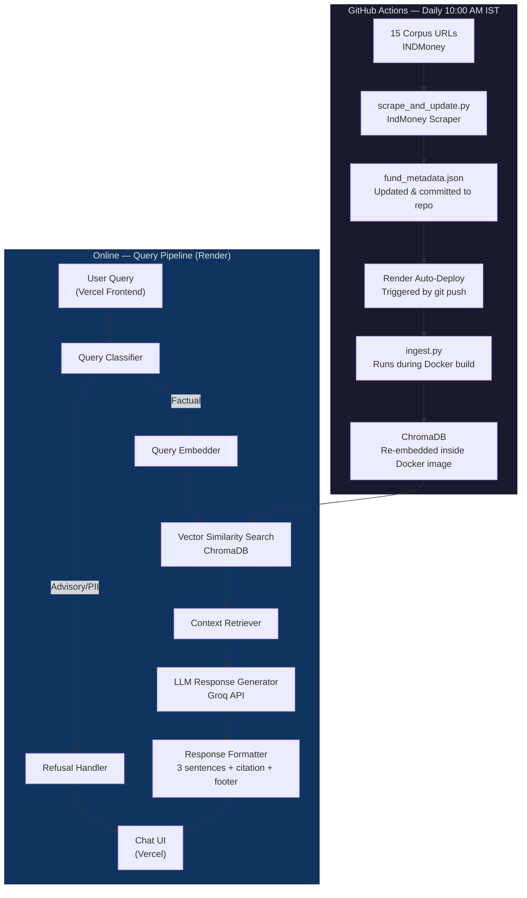
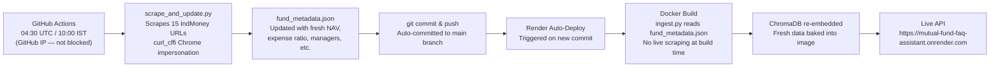
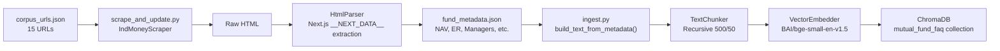
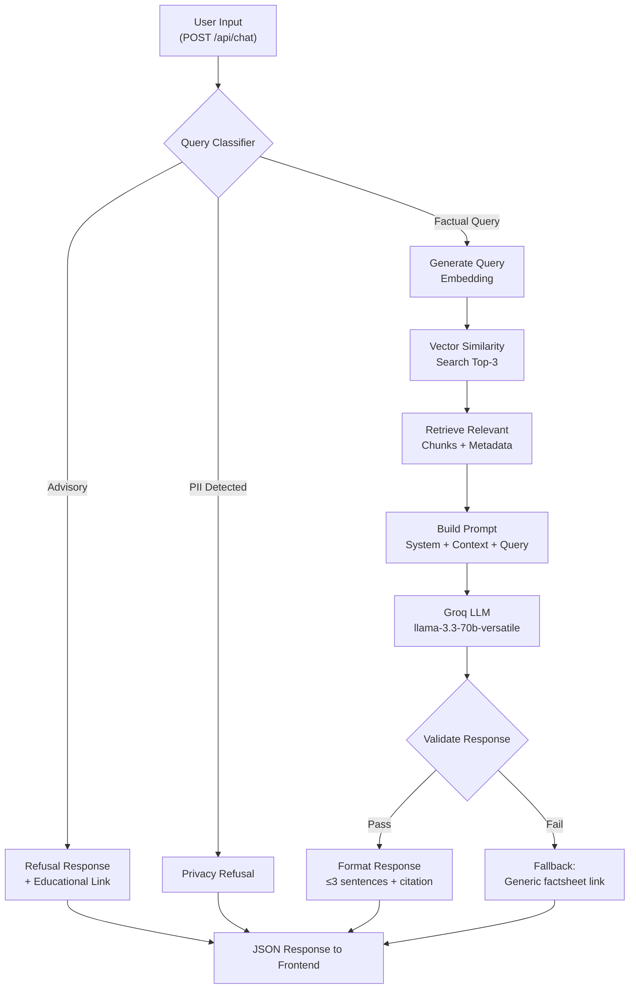
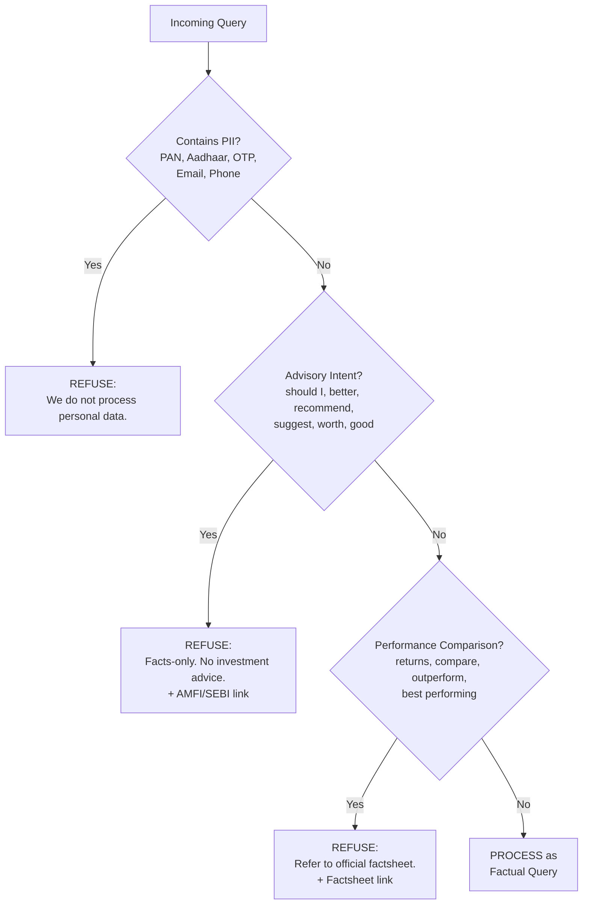
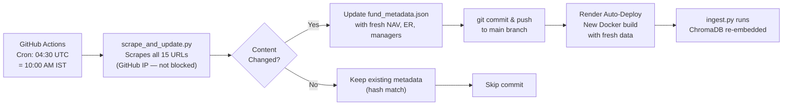

# Mutual Fund FAQ Assistant — Architecture Document

## 1. High-Level Architecture

The system follows a **Retrieval-Augmented Generation (RAG)** pattern with a clear separation between the **ingestion pipeline** (offline, scheduled daily via GitHub Actions) and the **query pipeline** (online/real-time).



---

## 2. Deployment Architecture (Live — June 2026)

| Component | Platform | Details |
|---|---|---|
| **Frontend** | Vercel | React 19 + Vite 8, auto-deployed from `main` branch |
| **Backend API** | Render (Docker) | FastAPI + ChromaDB + Sentence Transformers baked into image |
| **Backend URL** | `https://mutual-fund-faq-assistant.onrender.com` | Health: `/api/health`, Chat: `/api/chat` |
| **Data Refresh** | GitHub Actions | Daily cron at 04:30 UTC (10:00 AM IST) |
| **LLM** | Groq Cloud API | `llama-3.3-70b-versatile` |
| **Embeddings** | Local (Docker image) | `BAAI/bge-small-en-v1.5` via Sentence Transformers |
| **Vector Store** | ChromaDB (local) | Embedded into Docker image at build time |

---

## 3. Daily Data Refresh Flow

The key architectural decision is that **IndMoney blocks requests from Docker/cloud IPs (403)**. The solution splits the ingestion into two stages:



| Stage | Script | Runner | Action |
|---|---|---|---|
| **Scrape** | `scripts/scrape_and_update.py` | GitHub Actions | Fetches fresh HTML from IndMoney, parses metadata, writes `fund_metadata.json` |
| **Ingest** | `scripts/ingest.py` | Docker build (Render) | Reads `fund_metadata.json`, chunks text, generates embeddings, stores in ChromaDB |

---

## 4. System Components

### 4.1 Ingestion Pipeline



| Stage | File | Description |
|---|---|---|
| **Web Scraper** | `backend/ingestion/scraper.py` | Fetches HTML from 15 IndMoney URLs using `curl_cffi` Chrome impersonation. Retries 3x with jitter. |
| **HTML Parser** | `backend/ingestion/parser.py` | Extracts structured metadata from Next.js `__NEXT_DATA__` JSON embedded in page HTML. Fallback to regex extraction. |
| **Metadata Store** | `backend/data/fund_metadata.json` | Pre-scraped JSON file committed to repo. Updated daily by GitHub Actions. Read by Docker build. |
| **Orchestrator (Scrape)** | `scripts/scrape_and_update.py` | Daily scheduler script — scrapes all 15 URLs and overwrites `fund_metadata.json`. |
| **Orchestrator (Ingest)** | `scripts/ingest.py` | Reads `fund_metadata.json`, builds text docs, chunks, embeds, stores in ChromaDB. |
| **Text Chunker** | `backend/ingestion/chunker.py` | `RecursiveCharacterTextSplitter` — 500 chars, 50 overlap. |
| **Embedder** | `backend/ingestion/embedder.py` | Sentence Transformers local model, ChromaDB persistent client. |

### 4.2 Query Pipeline (Online — FastAPI on Render)



---

## 5. Query Classification Logic



### Classification Categories

| Category | Example Queries | Action |
|---|---|---|
| **Factual** | "What is the expense ratio of ICICI Small Cap Fund?" | Process via RAG pipeline |
| **Advisory** | "Should I invest in ELSS fund?" | Polite refusal + AMFI link |
| **Comparison** | "Which fund gave better returns?" | Refusal + factsheet link |
| **PII** | "My PAN is ABCDE1234F" | Privacy refusal, no processing |
| **Out-of-scope** | "What's the weather today?" | Polite redirect to fund queries |

---

## 6. Data Model

### 6.1 Fund Metadata Schema (`fund_metadata.json`)

```json
{
  "fund_id": "icici-pru-smallcap-direct-growth",
  "fund_name": "ICICI Prudential Smallcap Fund",
  "fund_category": "Small Cap Fund",
  "fund_group": "Equity Funds",
  "fund_plan": "Direct Plan Growth",
  "nav": "₹97.03",
  "nav_date": "04 Jun 2026",
  "expense_ratio": "0.66%",
  "exit_load": "1.0%",
  "min_sip": "₹100",
  "min_lumpsum": "₹5,000",
  "benchmark_index": "Nifty Smallcap 250 TR INR",
  "riskometer": "Very High Risk",
  "lock_in": "No Lock-in",
  "fund_managers": ["Rajat Chandak", "Aatur Shah"],
  "aum": "₹8741 Cr",
  "fund_house": "ICICI Mutual Fund",
  "source_url": "https://www.indmoney.com/mutual-funds/...",
  "content_hash": "934a5c36...",
  "last_scraped": "2026-06-06T04:30:00+00:00"
}
```

### 6.2 Document Chunk Schema (ChromaDB)

```json
{
  "chunk_id": "uuid-v4",
  "fund_name": "ICICI Prudential Small Cap Fund",
  "fund_category": "Small Cap Fund",
  "source_url": "https://www.indmoney.com/mutual-funds/...",
  "chunk_text": "The expense ratio of this fund is 0.66%...",
  "chunk_index": 3,
  "metadata": {
    "fund_manager": "Rajat Chandak, Aatur Shah",
    "last_scraped": "2026-06-06",
    "riskometer": "Very High Risk"
  },
  "embedding": [0.023, -0.041, 0.118, "..."]
}
```

---

## 7. Response Format Specification

Every response from the assistant follows this strict template:

```
┌─────────────────────────────────────────────────┐
│  [Answer — Max 3 sentences, facts only]         │
│                                                 │
│  Source: [Clickable citation link]              │
│  Last updated from sources: YYYY-MM-DD          │
└─────────────────────────────────────────────────┘
```

---

## 8. Tech Stack

| Layer | Technology | Rationale |
|---|---|---|
| **Frontend** | React 19 + Vite 8 | Component-based UI, fast HMR, optimised production builds |
| **Styling** | Vanilla CSS (warm café theme) | Premium look, modern feel, no framework overhead |
| **Backend** | Python 3.11 + FastAPI | Async support, auto-generated OpenAPI docs, Pydantic validation |
| **Scraping** | `curl_cffi` | Impersonates Chrome to bypass Cloudflare 403 blocks |
| **Chunking** | LangChain `RecursiveCharacterTextSplitter` | Smart chunking with overlap |
| **Embeddings** | `BAAI/bge-small-en-v1.5` (Sentence Transformers, local) | High-quality, free, runs inside Docker |
| **Vector Store** | ChromaDB (local, persistent) | Zero-config, file-based, ideal for 15-URL corpus |
| **LLM** | Groq (`llama-3.3-70b-versatile`) | Fast, cost-effective, state-of-the-art |
| **Response Validation** | Custom Python validator | Enforces 3-sentence limit, citation check, footer |
| **Scheduler** | GitHub Actions (cron) | Daily automated refresh at 10:00 AM IST, no extra infra |
| **Hosting (Backend)** | Render (Docker) | Auto-deploy on git push, free tier available |
| **Hosting (Frontend)** | Vercel | Auto-deploy from `main`, global CDN |

---

## 9. Project Directory Structure

```
Mutual Fund FAQ Assistant/
├── .github/
│   └── workflows/
│       └── daily-ingestion.yml     # GitHub Actions: daily 10:00 AM IST refresh
├── docs/
│   ├── context.md                  # Project context & requirements
│   ├── implementation_plan.md      # Phase-wise build plan
│   └── architecture.md             # This document
├── backend/
│   ├── app/
│   │   ├── main.py                 # FastAPI entry point, CORS, lifespan
│   │   ├── config.py               # Environment & config variables
│   │   ├── models.py               # Pydantic request/response models
│   │   └── routes/
│   │       └── chat.py             # POST /api/chat endpoint
│   ├── ingestion/
│   │   ├── scraper.py              # IndMoney web scraper (curl_cffi)
│   │   ├── parser.py               # HTML → structured text + metadata
│   │   ├── chunker.py              # Text chunking logic
│   │   └── embedder.py             # Embedding generation & vector store
│   ├── rag/
│   │   ├── retriever.py            # Vector similarity search
│   │   ├── classifier.py           # Query classification (factual/advisory/PII)
│   │   ├── generator.py            # LLM response generation
│   │   ├── validator.py            # Response format validation
│   │   └── prompts.py              # System & user prompt templates
│   ├── data/
│   │   ├── corpus_urls.json        # 15 corpus URLs with fund metadata
│   │   ├── chroma_db/              # ChromaDB persistent storage (Docker image)
│   │   └── fund_metadata.json      # Pre-scraped fund metadata (updated daily)
│   └── requirements.txt            # Python dependencies
├── frontend/
│   ├── index.html                  # React Vite root template
│   ├── src/
│   │   ├── App.jsx                 # Main app — state, routing, API calls
│   │   ├── main.jsx                # React root mount
│   │   ├── index.css               # 3-column layout & café color theme
│   │   └── ui/
│   │       ├── ChatArea.jsx        # Chat messages + suggestive cards
│   │       ├── SidebarLeft.jsx     # Fund filter checkboxes
│   │       ├── SidebarRight.jsx    # Chat session history
│   │       └── Modals.jsx          # Delete/rename modal dialogs
│   └── package.json                # React dependencies (lucide-react, vite)
├── scripts/
│   ├── scrape_and_update.py        # Daily scheduler: scrape → update fund_metadata.json
│   ├── ingest.py                   # Build-time: metadata → ChromaDB embeddings
│   └── test_queries.py             # Automated test suite
├── Dockerfile                      # Multi-stage Docker build for Render
├── .env.example                    # Environment variable template
├── README.md                       # Setup instructions & overview
└── .gitignore
```

---

## 10. API Design

### POST `/api/chat`

**Request:**
```json
{
  "query": "What is the expense ratio of ICICI Prudential Small Cap Fund?",
  "session_id": "optional-session-uuid"
}
```

**Response (Factual):**
```json
{
  "status": "success",
  "type": "factual",
  "answer": "The expense ratio of ICICI Prudential Small Cap Fund (Direct Plan Growth) is 0.66%.",
  "citation": {
    "label": "INDMoney – ICICI Prudential Small Cap Fund",
    "url": "https://www.indmoney.com/mutual-funds/icici-prudential-smallcap-fund-direct-plan-growth-3588"
  },
  "last_updated": "2026-06-06"
}
```

**Response (Refusal):**
```json
{
  "status": "refused",
  "type": "advisory",
  "answer": "I can only provide factual information from official sources. For personalized investment advice, please consult a SEBI-registered financial advisor.",
  "citation": {
    "label": "AMFI – Investor Education",
    "url": "https://www.amfiindia.com/investor-corner/knowledge-center.html"
  },
  "last_updated": "2026-06-06"
}
```

### GET `/api/health`

```json
{
  "status": "healthy",
  "database": "connected",
  "collection_count": 45,
  "llm_provider": "Groq",
  "embedding_model": "BAAI/bge-small-en-v1.5",
  "llm_model": "llama-3.3-70b-versatile"
}
```

---

## 11. Security & Privacy Architecture

| Control | Implementation |
|---|---|
| **PII Detection** | Regex patterns for PAN, Aadhaar, phone, email, OTP |
| **No Storage** | No user queries or PII persisted to disk or database |
| **Input Sanitization** | All inputs stripped of HTML/script tags before processing |
| **Output Sanitization** | Responses checked for accidental PII leakage before delivery |
| **No Auth Required** | No user accounts, no login — stateless FAQ interface |

---

## 12. Scheduler — Daily Refresh via GitHub Actions



| Aspect | Approach |
|---|---|
| **Scheduler** | GitHub Actions cron |
| **Frequency** | Daily at 04:30 UTC = **10:00 AM IST** |
| **Manual Trigger** | `workflow_dispatch` in GitHub Actions UI |
| **Scraper Script** | `scripts/scrape_and_update.py` |
| **Ingestion Script** | `scripts/ingest.py` (reads `fund_metadata.json`) |
| **Change Detection** | MD5 hash comparison per URL |
| **Data Commit** | Auto-commits updated `fund_metadata.json` to `main` |
| **Deploy Trigger** | Render auto-deploys on every commit to `main` |
| **Failure Handling** | Falls back to last known good metadata if a URL fails |
| **Secrets** | `GROQ_API_KEY` stored as GitHub Actions secret |

---

## 13. Error Handling

| Scenario | Handling |
|---|---|
| No relevant chunks found | "I couldn't find specific information about this. Please refer to the official factsheet." + factsheet link |
| LLM generates advisory content | Response validator catches and replaces with a refusal |
| LLM exceeds 3 sentences | Validator truncates to first 3 sentences |
| Missing citation in LLM output | Validator appends the source URL from the top-ranked retrieved chunk |
| Scraper gets 403 (CI environment) | Falls back to last good metadata; logs warning |
| Vector store unavailable | Returns a generic error with a link to the AMC website |

---

## 14. Performance Targets

| Metric | Target |
|---|---|
| **Query Response Time** | < 3 seconds (end-to-end) |
| **Ingestion Time** | < 5 minutes (all 15 funds from metadata) |
| **Vector Search** | < 100ms (ChromaDB local) |
| **Retrieval Accuracy** | Top-3 chunks contain the answer ≥ 90% of the time |
| **Refusal Accuracy** | Correctly refuse advisory queries ≥ 95% of the time |
| **Data Freshness** | Updated daily by 10:00 AM IST |

---

## 15. Architecture Decisions & Rationale

| Decision | Rationale |
|---|---|
| **ChromaDB over Pinecone/Weaviate** | Small corpus (15 URLs), no need for cloud vector DB. Local persistence is simpler and free. |
| **FastAPI over Flask/Express** | Async support, auto-generated OpenAPI docs, Pydantic validation out of the box. |
| **Separate classifier before RAG** | Prevents wasted LLM calls on advisory/PII queries. Faster refusals. |
| **Chunk overlap of 50 chars** | Prevents information loss at chunk boundaries. |
| **Response validator as post-processing** | Acts as a safety net — ensures compliance even if LLM deviates from instructions. |
| **No user authentication** | Facts-only public FAQ — no personalization needed, minimizes attack surface. |
| **Metadata-only ingestion at Docker build** | IndMoney blocks cloud IPs; GitHub Actions IPs can scrape. Split scrape (GH Actions) from embed (Docker build) to avoid 403s. |
| **Render + Vercel over single host** | Render handles Python/Docker well; Vercel excels at React/static hosting. Each serves its best use case. |

---

## 16. Future Extensibility

| Enhancement | Description |
|---|---|
| **Multi-AMC Support** | Add corpus URLs for other AMCs (SBI, HDFC, Axis) — same pipeline, separate collections in ChromaDB. |
| **Slack/Email Alerts on Ingestion Failure** | Notify when the daily GitHub Actions run fails or detects anomalies. |
| **Conversation Memory** | Add session-based context for multi-turn queries (e.g., "What about its exit load?"). |
| **Voice Interface** | Integrate Web Speech API for voice-based queries. |
| **Analytics Dashboard** | Track popular queries, refusal rates, and corpus coverage gaps. |
| **Multilingual Support** | Hindi/regional language support using multilingual embeddings. |
