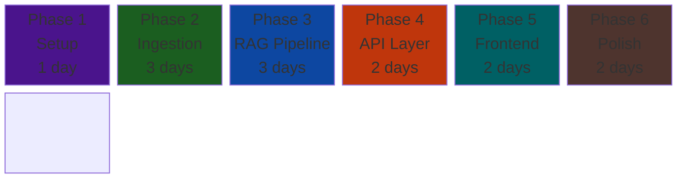
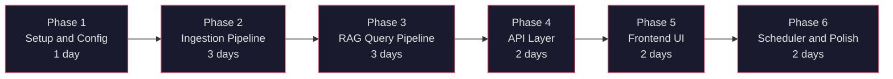
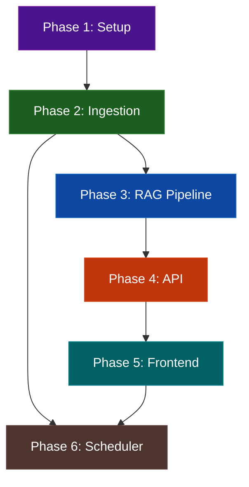

# Mutual Fund FAQ Assistant — Phase-Wise Implementation Plan

## Overview

This document breaks down the full build of the Mutual Fund FAQ Assistant into **6 phases**, ordered by dependency. Each phase lists the files to create/modify, key tasks, acceptance criteria, and estimated effort.



---

## Phase 1 — Project Setup & Configuration

> **Goal:** Establish project structure, dependencies, environment config, and corpus URL registry.

### Files to Create

| # | File | Purpose |
|---|---|---|
| 1 | `backend/requirements.txt` | All Python dependencies |
| 2 | `backend/app/config.py` | Environment variables, paths, constants |
| 3 | `backend/data/corpus_urls.json` | 15 corpus URLs with fund metadata |
| 4 | `.env.example` | Template for environment variables |
| 5 | `.gitignore` | Exclude `.env`, `__pycache__`, `chroma_db/` (optional) |
| 6 | `README.md` | Project overview (stub — finalized in Phase 6) |

### Tasks

- [x] Initialize project directory structure as defined in architecture
- [x] Create `requirements.txt` with pinned versions:
  ```
  fastapi>=0.104.0
  uvicorn>=0.24.0
  requests>=2.31.0
  beautifulsoup4>=4.12.0
  langchain>=0.1.0
  langchain-text-splitters>=0.0.1
  chromadb>=0.4.0
  groq>=0.4.0
  python-dotenv>=1.0.0
  pydantic>=2.5.0
  ```
- [x] Build `config.py` with:
  - `GROQ_API_KEY` (from env)
  - `CHROMA_DB_PATH` → `backend/data/chroma_db/`
  - `CORPUS_URLS_PATH` → `backend/data/corpus_urls.json`
  - `FUND_METADATA_PATH` → `backend/data/fund_metadata.json`
  - `EMBEDDING_MODEL` → `BAAI/bge-large-en-v1.5`
  - `LLM_MODEL` → `llama-3.3-70b-versatile`
  - `CHUNK_SIZE` → `500`
  - `CHUNK_OVERLAP` → `50`
  - `TOP_K` → `3`
- [x] Create `corpus_urls.json` with all 15 fund URLs, names, categories, and fund groups
- [x] Create `.env.example` and `.gitignore`

### Acceptance Criteria

- [x] `python -c "from backend.app.config import settings"` runs without error
- [x] `corpus_urls.json` contains exactly 15 entries with valid URLs
- [x] Directory structure matches architecture spec

### Estimated Effort: **1 day**

---

## Phase 2 — Ingestion Pipeline

> **Goal:** Scrape all 15 INDMoney URLs, parse HTML, extract metadata (including fund manager), chunk text, generate embeddings, and store in ChromaDB.

### Files to Create

| # | File | Purpose |
|---|---|---|
| 1 | `backend/ingestion/scraper.py` | Fetch HTML from INDMoney URLs |
| 2 | `backend/ingestion/parser.py` | Clean HTML → structured text + metadata extraction |
| 3 | `backend/ingestion/chunker.py` | Split text into overlapping chunks |
| 4 | `backend/ingestion/embedder.py` | Generate embeddings, upsert to ChromaDB |
| 5 | `scripts/ingest.py` | Orchestrator — runs the full pipeline end-to-end |
| 6 | `backend/data/fund_metadata.json` | Auto-generated output of extracted metadata |

### Tasks

#### 2.1 Web Scraper (`scraper.py`)
- [x] Fetch HTML for each URL in `corpus_urls.json`
- [x] Add retry logic (max 3 retries, exponential backoff)
- [x] Add rate limiting (1-second delay between requests)
- [x] Handle HTTP errors gracefully (log and continue)
- [x] Return raw HTML + URL + status per fund (and bypassed Cloudflare via `curl-cffi`)

#### 2.2 HTML Parser (`parser.py`)
- [x] Strip navigation, ads, footers, scripts, styles
- [x] Extract fund-specific sections:
  - Fund name, category, plan type
  - NAV, expense ratio, exit load
  - Min SIP, min lumpsum
  - Benchmark index, riskometer
  - Lock-in period (for ELSS)
  - **Fund manager name(s)** (auto-extracted)
  - AUM, fund house
- [x] Return cleaned text + structured metadata dict per fund
- [x] Store metadata to `fund_metadata.json`

#### 2.3 Text Chunker (`chunker.py`)
- [x] Use `RecursiveCharacterTextSplitter` from LangChain
- [x] Config: `chunk_size=500`, `chunk_overlap=50`
- [x] Attach metadata (fund name, category, source URL, chunk index) to each chunk
- [x] Return list of chunks with metadata

#### 2.4 Embedding & Storage (`embedder.py`)
- [x] Initialize ChromaDB persistent client at `CHROMA_DB_PATH`
- [x] Create/reset collection `mutual_fund_faq`
- [x] Generate embeddings via BAAI (`BAAI/bge-large-en-v1.5`) locally
- [x] Upsert chunks with embeddings + metadata into ChromaDB
- [x] Log total chunks stored and ingestion timestamp

#### 2.5 Orchestrator (`scripts/ingest.py`)
- [x] Load `corpus_urls.json`
- [x] Run: Scrape → Parse → Chunk → Embed (for each URL)
- [x] Implement change detection (hash comparison with previous run)
- [x] Print ingestion summary (URLs processed, chunks created, errors)
- [x] Update `last_scraped` date in metadata


### Acceptance Criteria

- [x] `python scripts/ingest.py` completes without error
- [x] `fund_metadata.json` contains 15 entries with fund manager names
- [x] ChromaDB collection has >0 chunks with correct metadata
- [x] Re-running ingestion skips unchanged data (hash check)
- [x] Total ingestion time < 5 minutes

### Estimated Effort: **3 days**

---

## Phase 3 — RAG Query Pipeline

> **Goal:** Build the query classifier, vector retriever, LLM response generator, and response validator.

### Files to Create

| # | File | Purpose |
|---|---|---|
| 1 | `backend/rag/classifier.py` | Classify queries: factual / advisory / PII / out-of-scope |
| 2 | `backend/rag/retriever.py` | Vector similarity search against ChromaDB |
| 3 | `backend/rag/prompts.py` | System prompt + user prompt templates |
| 4 | `backend/rag/generator.py` | LLM call with retrieved context |
| 5 | `backend/rag/validator.py` | Enforce response format rules |

### Tasks

#### 3.1 Query Classifier (`classifier.py`)
- [x] **PII Detection** — regex patterns:
  - PAN: `[A-Z]{5}[0-9]{4}[A-Z]`
  - Aadhaar: `\d{4}\s?\d{4}\s?\d{4}`
  - Phone: `(\+91|0)?\d{10}`
  - Email: standard email regex
  - OTP: `\b\d{4,6}\b` in OTP context
- [x] **Advisory Intent Detection** — keyword list:
  - `should I`, `recommend`, `suggest`, `better`, `worth`, `good fund`, `best fund`, `invest in`
- [x] **Performance Comparison Detection** — keyword list:
  - `compare`, `outperform`, `returns`, `best performing`, `CAGR`, `vs`
- [x] **Out-of-scope Detection** — fallback if no fund-related keywords found
- [x] Return classification: `{ type: "factual" | "advisory" | "pii" | "comparison" | "out_of_scope" }`

#### 3.2 Vector Retriever (`retriever.py`)
- [x] Accept query string, embed using same model as ingestion
- [x] Query ChromaDB collection with `top_k=3`
- [x] Return ranked list of chunks with metadata and similarity scores
- [x] Filter out chunks below a minimum similarity threshold (using L2 distance cutoff)

#### 3.3 Prompt Templates (`prompts.py`)
- [x] Define `SYSTEM_PROMPT` enforcing strict factual bounds and rules
- [x] Define `USER_PROMPT_TEMPLATE` with context and question placeholders
- [x] Define `REFUSAL_TEMPLATES` for advisory, PII, comparison, out-of-scope, and greeting

#### 3.4 Response Generator (`generator.py`)
- [x] Accept classified query + retrieved chunks
- [x] For factual queries:
  - Build prompt from template
  - Call Groq chat completion (llama-3.3-70b-versatile)
  - Return raw LLM response
- [x] For non-factual queries:
  - Return appropriate refusal template with educational link
- [x] Handle LLM API errors with fallback response

#### 3.5 Response Validator (`validator.py`)
- [x] **Sentence count check** — max 3 sentences
- [x] **Citation check** — exactly 1 URL present
- [x] **Footer check** — contains `"Last updated from sources:"`
- [x] **Auto-fix:**
  - Truncate to 3 sentences if exceeded
  - Append source URL from top chunk if citation missing
  - Append footer with `last_scraped` date if missing
- [x] Return validated response + validation report

### Acceptance Criteria

- [x] Advisory query → polite refusal with AMFI/SEBI link
- [x] PII in query → immediate refusal, no processing
- [x] Factual query → ≤3 sentence answer with 1 citation + footer
- [x] Out-of-scope query → polite redirect
- [x] Validator auto-fixes malformed LLM outputs

### Estimated Effort: **3 days**

---

## Phase 4 — API Layer (FastAPI)

> **Goal:** Expose the RAG pipeline via a REST API with proper request/response models.

### Files to Create

| # | File | Purpose |
|---|---|---|
| 1 | `backend/app/main.py` | FastAPI app initialization, CORS, lifespan |
| 2 | `backend/app/models.py` | Pydantic request/response schemas |
| 3 | `backend/app/routes/chat.py` | `POST /api/chat` endpoint |

### Tasks

#### 4.1 FastAPI App (`main.py`)
- [x] Initialize FastAPI with title, description, version
- [x] Configure CORS (allow frontend origin)
- [x] Add lifespan handler to initialize ChromaDB client on startup
- [x] Include chat router
- [x] Add health check endpoint: `GET /api/health`

#### 4.2 Pydantic Models (`models.py`)
- [x] `ChatRequest`:
  ```python
  class ChatRequest(BaseModel):
      query: str = Field(..., min_length=1, max_length=500)
      session_id: Optional[str] = None
  ```
- [x] `Citation`:
  ```python
  class Citation(BaseModel):
      label: str
      url: str
  ```
- [x] `ChatResponse`:
  ```python
  class ChatResponse(BaseModel):
      status: Literal["success", "refused"]
      type: Literal["factual", "advisory", "pii", "comparison", "out_of_scope"]
      answer: str
      citation: Citation
      last_updated: str
  ```

#### 4.3 Chat Endpoint (`routes/chat.py`)
- [x] `POST /api/chat` → accepts `ChatRequest`, returns `ChatResponse`
- [x] Pipeline flow:
  1. Classify query
  2. If non-factual → return refusal response
  3. If factual → retrieve → generate → validate → return
- [x] Input sanitization (strip HTML/script tags)
- [x] Error handling with appropriate HTTP status codes
- [x] Request logging (no PII logged)

### Acceptance Criteria

- [x] `uvicorn backend.app.main:app --reload` starts without error
- [x] `POST /api/chat` with factual query returns valid `ChatResponse`
- [x] `POST /api/chat` with advisory query returns refusal
- [x] `GET /api/health` returns `200 OK`
- [x] OpenAPI docs available at `/docs`
- [x] CORS configured for frontend

### Estimated Effort: **2 days**

---

## Phase 5 — Frontend Chat UI (React & Vite)

> **Goal:** Build a premium, clean, and modern 3-column desktop dashboard using a React Vite-scaffolded web application, featuring the warm café-inspired color palette, INDMoney AI branding, checkboxes filter sync, and conversational state integrations.

### Files to Create/Modify

| # | File | Purpose |
|---|---|---|
| 1 | `frontend/index.html` | React Vite root template (metadata & font imports) |
| 2 | `frontend/src/index.css` | 3-column layout styling and global café color variables |
| 3 | `frontend/src/App.jsx` | Main React layout, state controllers, fetch query handlers, modal overlays, and theme block logic |
| 4 | `frontend/src/main.jsx` | React root entry mount |
| 5 | `frontend/package.json` | React dependencies and scripts (Vite, React, Lucide Icons) |

### Tasks

#### 5.1 Project Scaffolding
- [x] Create React app using `npx create-vite` in non-interactive mode.
- [x] Configure dependencies including `lucide-react` for standard icons.
- [x] Clean default scaffold styles to avoid grid collisions.

#### 5.2 HTML & Styling Structure (`index.html`, `index.css`)
- [x] Configure Google fonts (`Outfit` and `Inter`) and metadata description in `index.html`.
- [x] Implement the 3-column desktop layout style grid in `index.css`:
  - Sidebar Left (Width: `240px`, background: `#FAF9F6`).
  - Main Chat Panel (Width: `1fr`, background: `#F5F2EB`).
  - Sidebar Right (Width: `280px`, background: `#FAF9F6`).
- [x] Implement the café variables color set (ivory surfaces, cream centers, royal blue indicators, navy headers, gray descriptions).
- [x] Styling for suggestive cards featuring checkmark indicators (scale transitions, selected borders).
- [x] Implement media query overrides for tablets and small mobile browsers.

#### 5.3 React Application Logic (`App.jsx`)
- [x] Initialize states for scheme checklists, card highlights, text query fields, histories, and modal windows.
- [x] Bind cards check state to Selection Counter (`Selected: [ X ]`) sitting at the top-left corner above the input field, allowing the input field to expand.
- [x] Render individual selected funds as interactive option pills next to the selection count (clicking them removes them from selection).
- [x] Configure form submits compiled from both active cards and text input boxes.
- [x] Call the FastAPI `POST /api/chat` route with active query parameter models, displaying typing loaders.
- [x] Implement in-chat rendering bubbles: User messages (royal blue background right) and Assistant messages (ivory/dark-slate left, facts citations pills, updated scraper dates).
- [x] Render SEBI regulatory advisories (warning themed panels with educational portals) and PAN/PII leaks (error themed panels).
- [x] Implement sidebar session thread clicks reloading conversation history arrays and allow updating chat names (renaming on double-click or edit icon).
- [x] Integrate circular SVG brand logo and AI badge next to it.
- [x] Enforce Light Mode theme as per SEBI brand design guidelines.

### Acceptance Criteria

- [x] Web app renders the premium, 3-column desktop layout from the mockup.
- [x] Suggestive prompt grid filters dynamically depending on checked categories.
- [x] Dynamic selected funds displayed as tag option pills above the expanded input box.
- [x] Clean and warm Café visual elements aligned with INDMoney branding.
- [x] Chat threads editable and deletable in the sidebar.
- [x] Circular SVG brand logo and AI badge rendered as per brand guidelines.
- [x] Communication to backend FastAPI server is fully integrated and displays answers, citation links, and refuses advisory queries correctly.
- [x] Production build (`npm run build`) builds without error.
- [x] Responsive layout displays on mobile viewports.

### Estimated Effort: **2 days**

---

## Phase 6 — Scheduler, Testing & Polish

> **Goal:** Set up GitHub Actions for daily ingestion, write test queries, finalize README, and polish.

### Files to Create

| # | File | Purpose |
|---|---|---|
| 1 | `.github/workflows/daily-ingestion.yml` | Daily cron workflow |
| 2 | `scripts/test_queries.py` | Automated test suite |
| 3 | `README.md` | Final documentation |

### Tasks

#### 6.1 GitHub Actions Workflow
- [x] Create `.github/workflows/daily-ingestion.yml` (from architecture spec)
- [x] Configure cron: `0 2 * * *` (daily at 02:00 UTC)
- [x] Add `workflow_dispatch` for manual triggers
- [x] Steps: checkout → setup Python → install deps → run ingestion → commit data
- [x] Add `GROQ_API_KEY` as GitHub Actions secret
- [x] Test workflow with manual dispatch

#### 6.2 Test Suite (`scripts/test_queries.py`)
- [x] **Factual query tests** (expect success):
  ```
  "What is the expense ratio of ICICI Prudential Small Cap Fund?"
  "What is the exit load for ICICI Prudential ELSS Tax Saver Fund?"
  "What is the minimum SIP amount for ICICI Prudential Flexi Cap Fund?"
  "Who is the fund manager of ICICI Prudential Mid Cap Fund?"
  "What is the benchmark index for ICICI Prudential Nifty 50 Index Fund?"
  "What is the riskometer category of ICICI Prudential Gold ETF FoF?"
  ```
- [x] **Refusal tests** (expect refusal):
  ```
  "Should I invest in ICICI Prudential Small Cap Fund?"
  "Which fund is better — Flexi Cap or Multi Cap?"
  "Will this fund give 20% returns?"
  "My PAN is ABCDE1234F, check my portfolio."
  ```
- [x] **Edge case tests**:
  ```
  "" (empty query)
  "asdfghjkl" (gibberish)
  "What is the weather today?" (out-of-scope)
  ```
- [x] Validate response format for each test (sentences, citation, footer)
- [x] Print pass/fail summary

#### 6.3 README Finalization
- [x] Project description and architecture overview
- [x] Setup instructions (clone, install, configure `.env`, run ingestion, start server)
- [x] Usage guide with example queries
- [x] Selected AMC and 15 schemes listed
- [x] Known limitations
- [x] Disclaimer: `"Facts-only. No investment advice."`

#### 6.4 Final Polish
- [x] End-to-end walkthrough: ingestion → API → UI
- [x] Verify all 15 funds return correct data
- [x] Check response times < 3 seconds
- [x] Verify refusal handling for all categories
- [x] Mobile responsiveness check
- [x] Clean up unused code, add docstrings

### Acceptance Criteria

- [x] GitHub Actions workflow runs successfully (manual dispatch)
- [x] All test queries pass with correct response types
- [x] README is complete with setup instructions
- [x] End-to-end flow works: type query → get sourced answer
- [x] Response time < 3 seconds for all queries

### Estimated Effort: **2 days**

---

## Phase Summary



| Phase | Focus | Files | Effort |
|---|---|---|---|
| **1** | Project Setup & Config | 6 | 1 day |
| **2** | Ingestion Pipeline | 6 | 3 days |
| **3** | RAG Query Pipeline | 5 | 3 days |
| **4** | API Layer (FastAPI) | 3 | 2 days |
| **5** | Frontend Chat UI | 3 | 2 days |
| **6** | Scheduler, Testing & Polish | 3 | 2 days |
| | **Total** | **26 files** | **13 days** |

---

## Dependency Graph



> [!IMPORTANT]
> **Phase 2 (Ingestion)** is the critical path. The RAG pipeline, API, and frontend all depend on having a populated vector store. Prioritize getting ingestion working end-to-end first.

> [!TIP]
> **Parallel opportunity:** Phase 5 (Frontend) can be developed in parallel with Phase 3–4 using mock API responses, then integrated once the API is ready.
